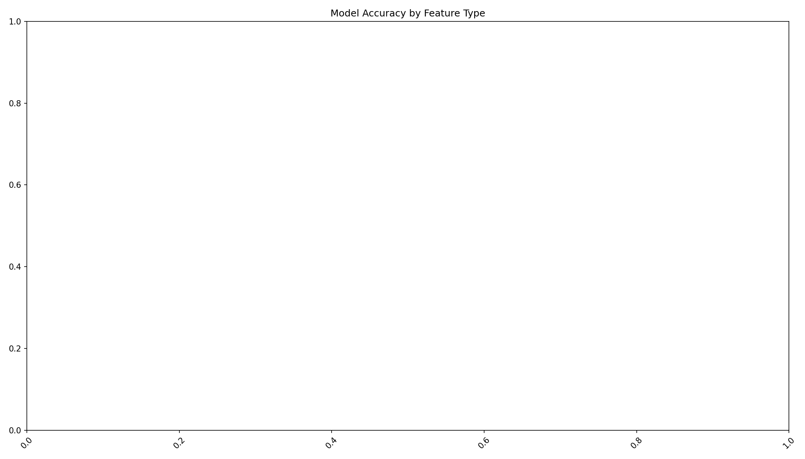
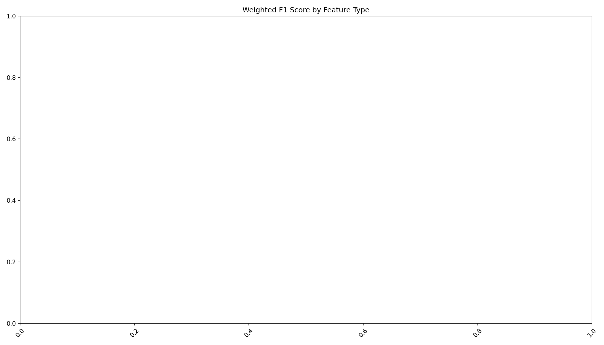

# Итоговый отчёт по проекту «Человек vs Робот»

## Сравнение моделей на акустических, фонетических и комбинированных признаках

### Сводная таблица метрик

| model   | accuracy   | precision_human   | recall_human   | f1_human   | precision_robot   | recall_robot   | f1_robot   | robot_f1   | confusion_matrix   | device   | class_weights   | Model   | FeatureType   | Accuracy   | F1_Weighted   | F1_Human   | F1_Robot   | Precision_Human   | Recall_Human   | Precision_Robot   | Recall_Robot   |
|---------|------------|-------------------|----------------|------------|-------------------|----------------|------------|------------|--------------------|----------|-----------------|---------|---------------|------------|---------------|------------|------------|-------------------|----------------|-------------------|----------------|

### Лучшие модели по Accuracy

| Model   | FeatureType   | Accuracy   | F1_Weighted   |
|---------|---------------|------------|---------------|

### Графики

### Выводы

### Заключение

На основе полученных результатов... (добавьте ручные выводы)